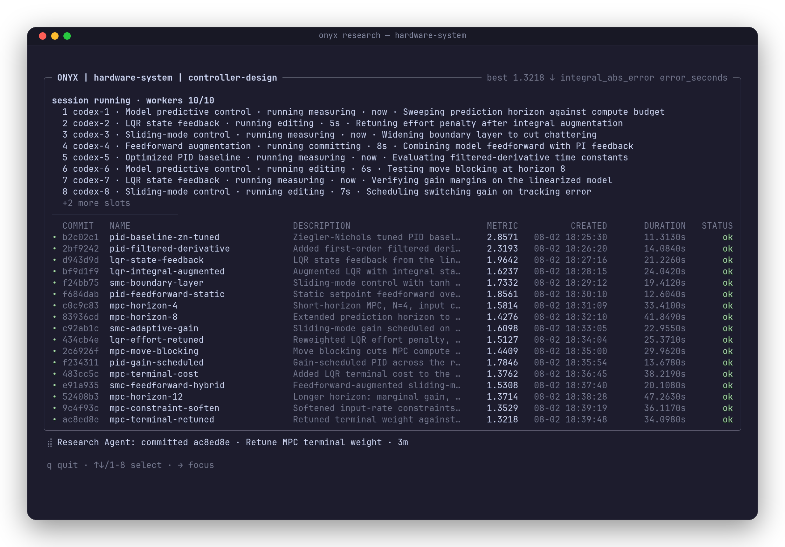

<p align="center">
  <picture>
    <source media="(prefers-color-scheme: dark)" srcset="assets/logo-dark.svg">
    
  </picture>
</p>

<p align="center">
  <em>Use large-scale AI agent teams to rapidly discover code improvements on your hardware systems.</em>
</p>

<p align="center">
  <a href="https://www.npmjs.com/package/@onyx-robotics/agent"></a>
  <a href="https://github.com/onyx-robotics/onyx-agent/actions/workflows/ci.yml"></a>
  <a href="https://onyxresearch.ai/docs"></a>
  <a href="https://app.onyxresearch.ai"></a>
</p>

<br>

<p align="center">
  
</p>

<br>

## Installation

```bash
# One-line installer
curl -fsSL https://onyxresearch.ai/install.sh | bash
```

The installer places `onyx` in `~/.local/bin` (override with
`ONYX_INSTALL_DIR`), walks you through PATH setup if needed, and opens browser
login on a local desktop. SSH sessions use device authorization instead. Press
`Ctrl+C` to authenticate later with `onyx login`. Installs without a controlling
terminal skip login rather than waiting; set `ONYX_INSTALL_NO_PROMPT=1` to skip
all interactive setup explicitly.

## Quickstart

Onyx includes a CLI, but the intended interface is to use onyx with your coding agent, via the `/onyx` skill included.

Open your coding agent inside the repository
you want to improve and run:

```bash
# Set up your repo to work with Onyx, no tutorial needed
/onyx Help me setup my project to run onyx research
```

Onyx will then do the setup for you while you provide input on things like the goal, metric, editable scope, and reliability/evaluation tooling. Onyx can scaffold its own metric evaluation tools, and then kick off a research session for you that can be steered at any time.

You can watch an active research session from a new terminal in the same directory with the CLI below, or using the [Onyx platform](https://app.onyxresearch.ai).

```bash
# Watch the research session from a new terminal in the same repo
onyx listen
```

Once you have a research session running, continue using your main-thread coding agent that you ran `/onyx` from to steer the research.
```bash
# Using same /onyx coding agent thread from earlier
Can you stop researching the PID controller, and instead build on the MPC controller more?

# Orchestrator agent uses CLI for you to steer the research...
```

## How it works

```
                ┌──────────────┐
                │     You      │
                └──────────────┘
                       ▲
                       │  Direct your requests through the Onyx agent.
                       ▼
                ┌──────────────┐
                │ Orchestrator │
                │    /onyx     │
                └──────────────┘
                       │
        ┌──────────────┼────────────────────┐
        ▼              ▼                    ▼
 ┌────────────┐  ┌────────────┐       ┌────────────┐
 │  Worker 1  │  │  Worker 2  │  ···  │  Worker N  │
 └────────────┘  └────────────┘       └────────────┘
        │              │                    │
        ▼              ▼                    ▼
 ┌────────────┐  ┌────────────┐       ┌────────────┐
 │ Experiments│  │ Experiments│  ···  │ Experiments│
 └────────────┘  └────────────┘       └────────────┘
```

Onyx uses a mix of deterministic CLI/processes with agents to keep research consistent, and results durable across sessions. Every experiment is a git commit with metrics and metadata so that the results can easily be turned into PRs once code improvements are found.

Every session is bounded: pass `--experiments <n>` for an exact accepted
experiment target, `--max-minutes <n>` for a deadline, or both. Scale a
running session with `onyx research scale --workers <n>` and stop it
gracefully with `onyx research stop`.

## Supported agents

| Agent | Support |
| --- | --- |
| [Claude Code](https://claude.com/claude-code) | Built-in launcher (`--agent claude`) + auto-installed `/onyx` skill |
| [Codex](https://openai.com/codex/) | Built-in launcher (`--agent codex`) + auto-installed `/onyx` skill |
| [OpenCode](https://opencode.ai) | Built-in launcher (`--agent opencode`) + auto-installed `/onyx` skill |
| Custom harness | Bring your own worker with `--worker-command` (see [CONTRIBUTING.md](CONTRIBUTING.md)) |

Built-in launchers spawn provider CLIs directly in non-interactive mode — no
extra configuration beyond having the provider CLI installed and
authenticated.

## Documentation

- [Installation](https://onyxresearch.ai/docs/installation) and
  [Quickstart](https://onyxresearch.ai/docs/quickstart)
- [Concepts](https://onyxresearch.ai/docs/concepts/projects-campaigns-experiments)
  — projects, campaigns, experiments, metrics, and the `onyx/` directory
- [CLI reference](https://onyxresearch.ai/docs/reference/cli)
- [Onyx platform](https://app.onyxresearch.ai) — review experiments, manage
  teams and API keys

## Development

```bash
bun install
bun run ci
```

To point the installed `onyx` command at this checkout, run
`onyx developer link .` then `onyx developer use dev`; switch back with
`onyx developer use release`. See [CONTRIBUTING.md](CONTRIBUTING.md) for the
full contributor guide, including skill/prompt regeneration, release builds,
and the custom harness contract.

## License

[Apache-2.0](LICENSE)
